# Topology Experiments

> Run on Google Cloud nodes

Let's test different depths (N-ary) of trees. We first want to understand the structures of trees that flux generates depending on the topology spec and number of nodes. Then, for each depth we will test:

1. Distribution from the root to all leaves (lowest level) 
2. Distribution from the root to all nodes (regardless of level)
3. Distribution from root to middle level, and then to leaves.

We would want to see if there is a more efficient strategy, and then we would want to be able to combine Flux, a snapshotter, and possibly a CSI to distribute large files in Kubernetes. The idea would be that:

1. The snapshotter (rank 0) would retrieve from the registry
2. Rank 0 would distribute to workers
3. The other ranks would have a CSI to bind to the node.

We could also JUST use a snapshotter OR the CSI.


## Flux Trees

Note that the flux-design* files were generated in the [kind-experiment](../kind-experiment) and you will need them here.

## Usage

Run the experiments! First we will do a max size of 2 on 6 nodes.

```bash
time gcloud container clusters create test-cluster \
    --threads-per-core=1 \
    --num-nodes=6 \
    --machine-type=c2d-standard-32 \
    --enable-gvnic \
    --network=mtu9k \
    --placement-type=COMPACT \
    --region=us-central1-a \
    --project=${GOOGLE_PROJECT} 

kubectl apply -f https://raw.githubusercontent.com/flux-framework/flux-operator/refs/heads/main/examples/dist/flux-operator.yaml

python run-experiment.py --data ./kary-designs.json --max-nodes=6 --max-size=2 --data-dir ./data/raw-max-6
time gcloud container clusters delete test-cluster --region=us-central1-a
python run-analysis.py --out ./data/parsed-max-6 --data ./data/raw-max-6
```
```
Experiments are done!
total time to run is 5793.205878019333 seconds
```

Next, let's just test a large size (30)

```bash
6:40
time gcloud container clusters create test-cluster \
    --threads-per-core=1 \
    --num-nodes=30 \
    --machine-type=c2d-standard-32 \
    --enable-gvnic \
    --network=mtu9k \
    --placement-type=COMPACT \
    --region=us-central1-a \
    --project=${GOOGLE_PROJECT} 

kubectl apply -f https://raw.githubusercontent.com/flux-framework/flux-operator/refs/heads/main/examples/dist/flux-operator.yaml

python run-experiment.py --data ./kary-designs.json --max-size=2 --exact-nodes=30 --data-dir ./data/raw-exact-30
time gcloud container clusters delete test-cluster --region=us-central1-a
python run-analysis.py --out ./data/parsed-exact-30 --data ./data/raw-exact-30
```
```console
Experiments are done!
total time to run is 9767.250812530518 seconds
```

## Results

### Google Cloud 6 Nodes

Let's look at 6 "nodes"

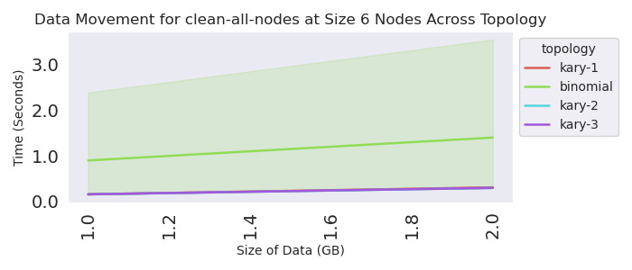
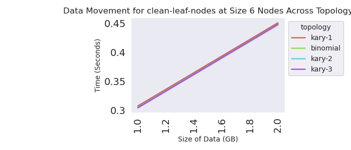
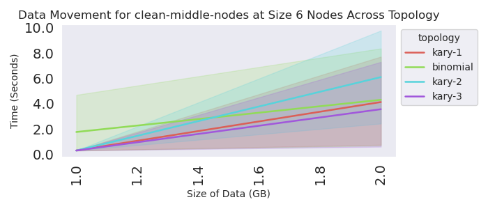

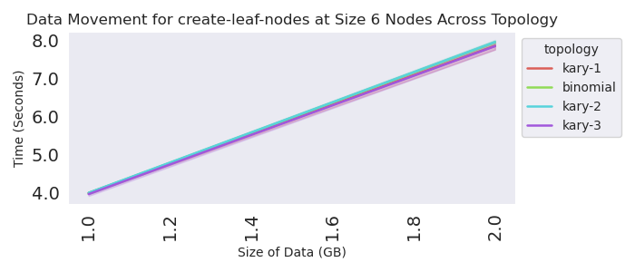
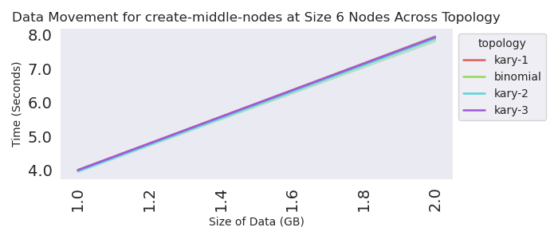
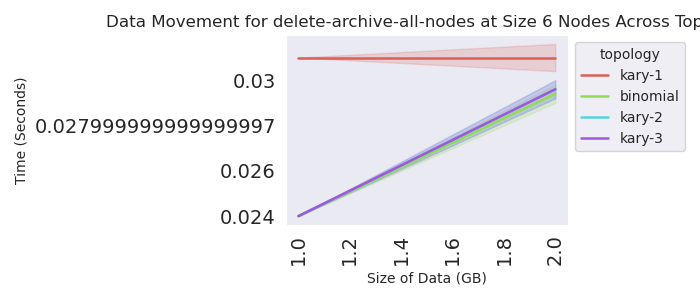
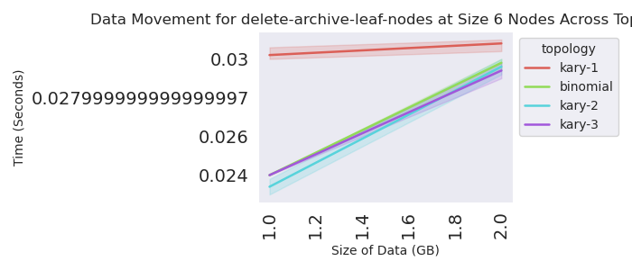
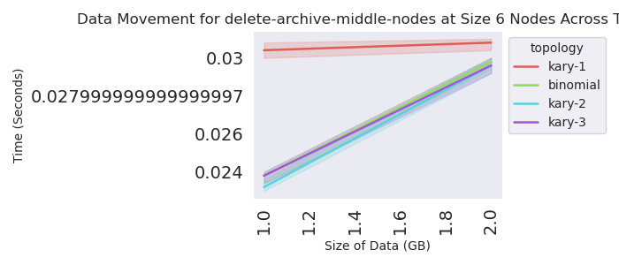
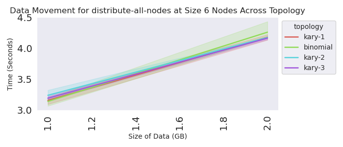
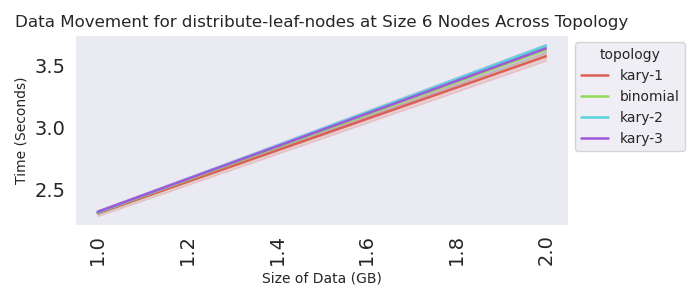
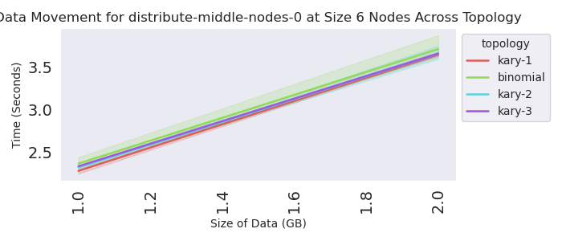
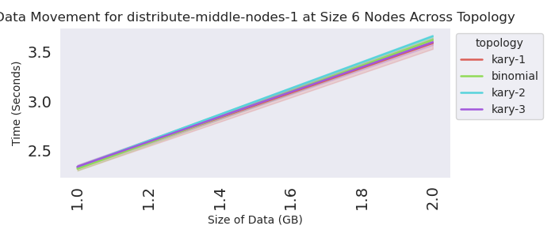

### Google Cloud 30 Nodes

This will allow for more "kary" designs.

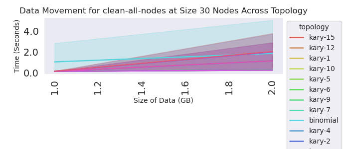
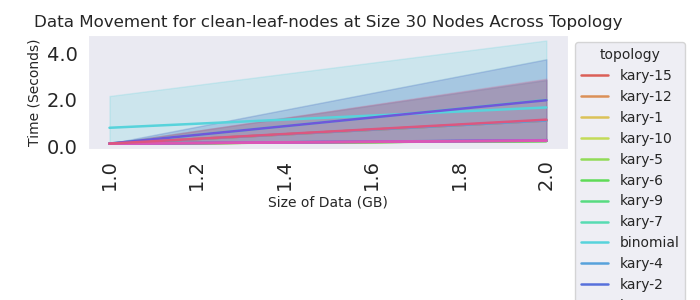
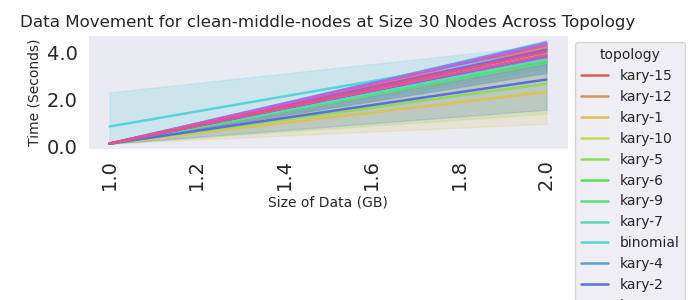
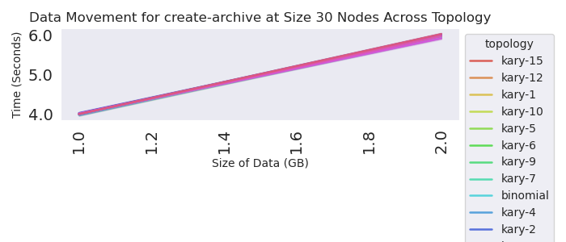
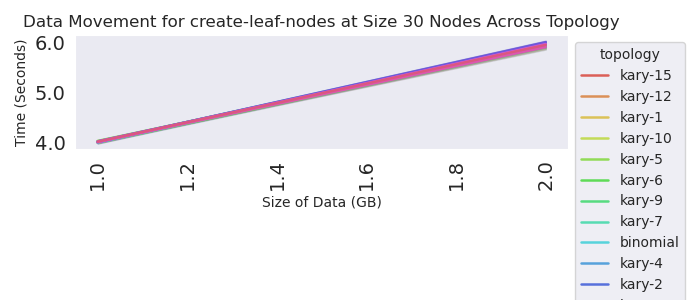
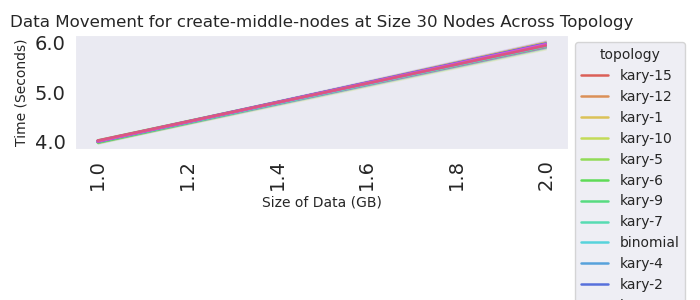
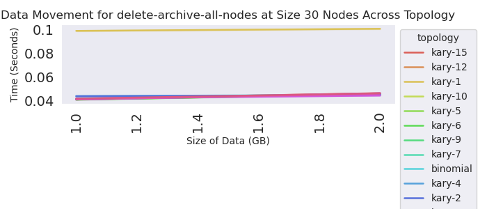
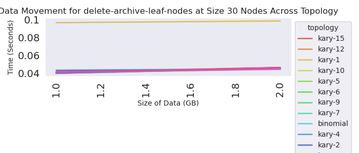
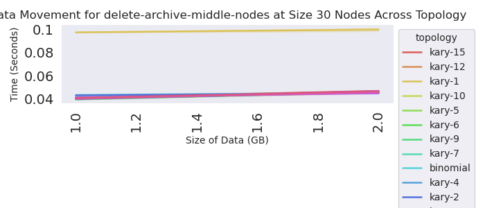
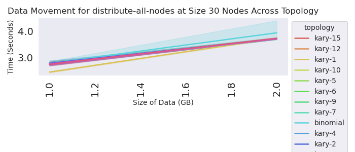
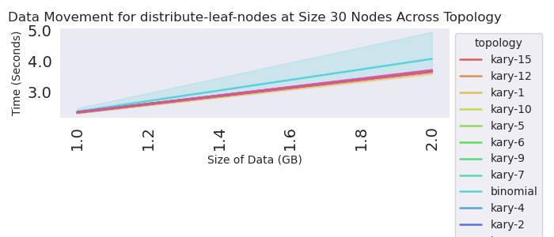
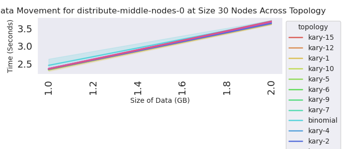
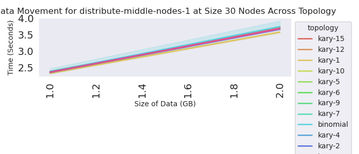


