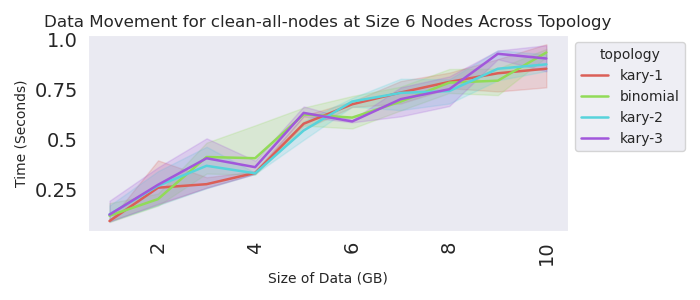

# Topology Experiments

> Run on Google Cloud nodes

Let's test different depths (N-ary) of trees. We first want to understand the structures of trees that flux generates depending on the topology spec and number of nodes. Then, for each depth we will test:

1. Distribution from the root to all leaves (lowest level) 
2. Distribution from the root to all nodes (regardless of level)
3. Distribution from root to middle level, and then to leaves.

We would want to see if there is a more efficient strategy, and then we would want to be able to combine Flux, a snapshotter, and possibly a CSI to distribute large files in Kubernetes. The idea would be that:

1. The snapshotter (rank 0) would retrieve from the registry
2. Rank 0 would distribute to workers
3. The other ranks would have a CSI to bind to the node.

We could also JUST use a snapshotter OR the CSI.

## Blob Sizes

This advice comes from [garlick](https://github.com/flux-framework/flux-core/issues/6461#issuecomment-2506714708)

> the performance will be sensitive to the tree fanout because each level of the tree will fetch data once from its parent, then provide it once to each child that is requesting it. Well, that would assume perfect caching but the LRU cache tries to maintain itself below 16MB so for large amounts of data the cache may thrash a bit. If you want to play with that limit, you could do something like

```console
flux module reload content purge-target-size=104857600 # 100mb
flux exec -r all flux module reload content purge-target-size=104857600 # 100mb
```

Not sure what effect that would have since it kind of depends on how the timing works out. You can peek at the cache size with

```bash
flux module stats content | jq
```

Note that we likely want to update the size 30 experiment by:

1. Adding the unset of the cache
2. Have the data file generated programatically (instead of needing to build into container, which will get large).
3. Test a smaller number of kary sizes (1, 2, and then possibly evens up to the largest size)
4. Also go up by even sizes for the GB sizes - it takes too long to do every single one!

## Flux Trees

Note that the flux-design* files were generated in the [kind-experiment](../kind-experiment) and you will need them here.

## Usage

Run the experiments! 

### 6 Nodes Test

First we will do a max size of 2 on 6 nodes.

```bash
time gcloud container clusters create test-cluster \
    --threads-per-core=1 \
    --num-nodes=6 \
    --machine-type=c2d-standard-32 \
    --enable-gvnic \
    --network=mtu9k \
    --placement-type=COMPACT \
    --region=us-central1-a \
    --project=${GOOGLE_PROJECT} 

kubectl apply -f https://raw.githubusercontent.com/flux-framework/flux-operator/refs/heads/main/examples/dist/flux-operator.yaml

python run-experiment.py --data ./kary-designs.json --max-nodes=6 --max-size=2 --data-dir ./data/raw-max-6 --template ./templates/minicluster-test.yaml
time gcloud container clusters delete test-cluster --region=us-central1-a
python run-analysis.py --out ./data/parsed-max-6 --data ./data/raw-max-6
```
```
Experiments are done!
total time to run is 5793.205878019333 seconds
```

### 30 Nodes Test

Next, let's just test a large size (30)

```bash
time gcloud container clusters create test-cluster \
    --threads-per-core=1 \
    --num-nodes=30 \
    --machine-type=c2d-standard-32 \
    --enable-gvnic \
    --network=mtu9k \
    --placement-type=COMPACT \
    --region=us-central1-a \
    --project=${GOOGLE_PROJECT} 

kubectl apply -f https://raw.githubusercontent.com/flux-framework/flux-operator/refs/heads/main/examples/dist/flux-operator.yaml

python run-experiment.py --data ./kary-designs.json --max-size=2 --exact-nodes=30 --data-dir ./data/raw-exact-30 --template ./templates/minicluster-test.yaml
time gcloud container clusters delete test-cluster --region=us-central1-a
python run-analysis.py --out ./data/parsed-exact-30 --data ./data/raw-exact-30
```
```console
Experiments are done!
total time to run is 9767.250812530518 seconds
```

### 6 Nodes

Google cloud was issuing an error, I switched to aws and it went away.

```bash
eksctl create cluster --config-file ./eks-config-6.yaml
aws eks update-kubeconfig --region us-east-2 --name topology-study

kubectl apply -f https://raw.githubusercontent.com/flux-framework/flux-operator/refs/heads/main/examples/dist/flux-operator.yaml

# Don't bother with smaller sizes, just 6
python run-experiment.py --data ./kary-designs.json --exact-nodes=6 --min-size=1 --max-size=10 --data-dir ./data/raw-exact-6-aws --template ./templates/minicluster.yaml --iters 3
eksctl delete cluster --config-file ./eks-config-6.yaml --wait
python run-analysis.py --out ./data/parsed-exact-6-aws --data ./data/raw-exact-6-aws
```
```console
Experiments (N=12) are done!
total time to run is 9715.973370552063 seconds
```

For this updated setup without a view, here is how to connect to the broker's socket:

```bash
flux proxy local:///mnt/flux/view/run/flux/local bash
```
```
flux dmesg
flux module stats content | jq
```

## Results

### Google Cloud 6 Nodes Test

Let's look at 6 "nodes"


### Google Cloud 30 Nodes Test

This will allow for more "kary" designs.


### AWS 6 Node Test

Without any bugs. I removed the middle distribution layer to reduce experiment running time.




