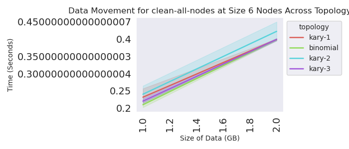
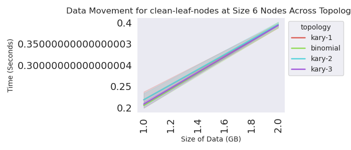
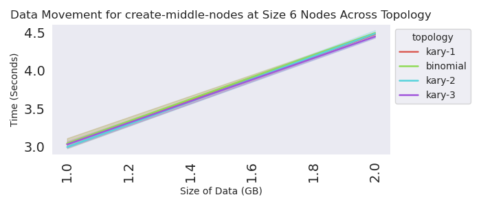
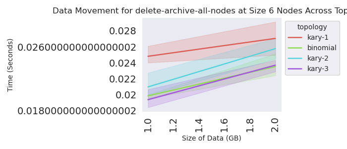
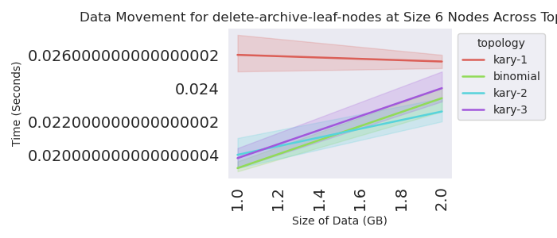
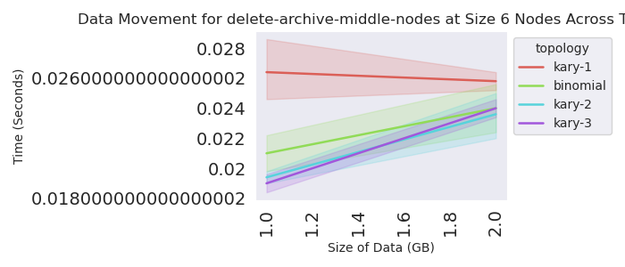
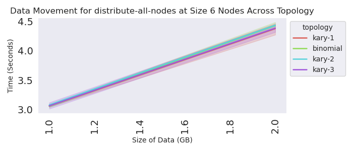
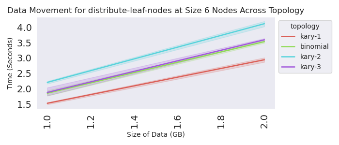
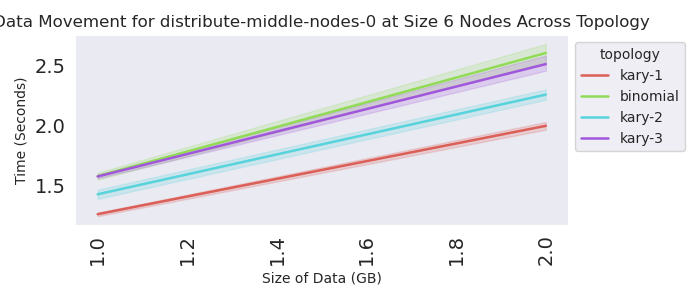

# Topology Experiments

Let's test different depths (N-ary) of trees. We first want to understand the structures of trees that flux generates depending on the topology spec and number of nodes. Then, for each depth we will test:

1. Distribution from the root to all leaves (lowest level) 
2. Distribution from the root to all nodes (regardless of level)
3. Distribution from root to middle level, and then to leaves.

We would want to see if there is a more efficient strategy, and then we would want to be able to combine Flux, a snapshotter, and possibly a CSI to distribute large files in Kubernetes. The idea would be that:

1. The snapshotter (rank 0) would retrieve from the registry
2. Rank 0 would distribute to workers
3. The other ranks would have a CSI to bind to the node.

We could also JUST use a snapshotter OR the CSI.

## Flux Trees

Let's test what the Flux topology looks like. This can be anywhere with flux, we will make faux nodes.
We will choose a subset of topologies with unique designs. Note that I ran a flux base, and then copied the script [kary_generator.py](docker/kary_generator.py) into it.

```bash
# This can be run in a container with flux! Shell in, and:
mkdir -p /tmp/kary
cd /tmp/kary
docker run -v /tmp/kary:/data -it fluxrm/flux-sched:jammy
$ cd /data
$ python3 kary_generator.py --job-name $(hostname)
```
The above generates a txt and json file, each that has topologies of interest for further testing.
The default will generate up to 32 nodes and 10 kary. The kary of 1 represents an extreme, where we essentially only have children. Binomial is more balanced, and then others are somewhere in-between.

## Usage

We are now going to use our topologies to drive an experiment. For testing, we will just run a subset in kind.
Create the cluster:

```bash
kind create cluster --config ./kind-config.yaml 
```

Install the Flux Operator

```bash
kubectl apply -f https://raw.githubusercontent.com/flux-framework/flux-operator/refs/heads/main/examples/dist/flux-operator.yaml
```

Run the experiment!

```bash
python run-experiment.py --data ./kary-designs.json --max-size=2
```
```console
Experiments are done!
total time to run is 3782.7171614170074 seconds
```

Let's look at 6 "nodes" - these go up to size 4, but we didn't include all the ranks (so incorrect)














To get data without segfault I had to limit the size of the archive to 2GB.

It looks like topology does matter for distribution steps, but this is on one local machine. We need to test at larger sizes in a cloud.
