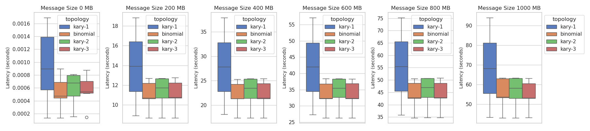
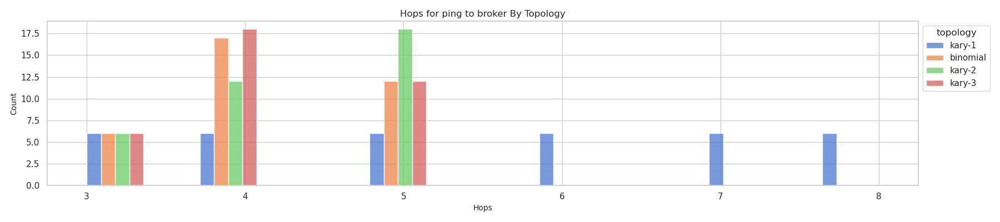
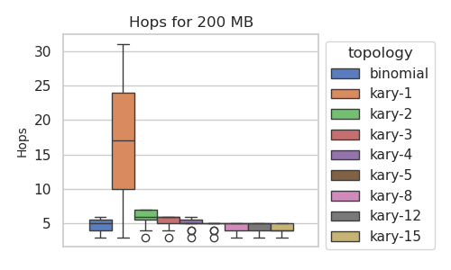
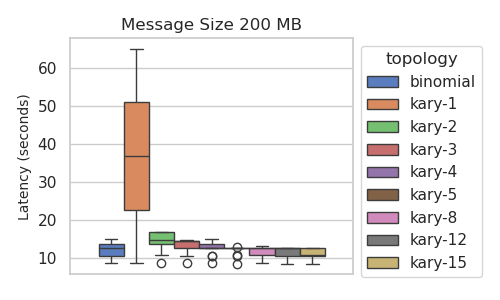
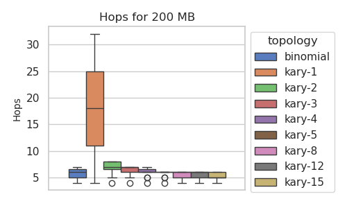

# Flux Topology (ping) Experiment

This is moving to AWS for a more robust setup.

## 6 Nodes

```bash
eksctl create cluster --config-file ./eks-config-6.yaml
aws eks update-kubeconfig --region us-east-2 --name topology-study

kubectl apply -f https://raw.githubusercontent.com/flux-framework/flux-operator/refs/heads/main/examples/dist/flux-operator.yaml

# Don't bother with smaller sizes, just 6
python run-experiment.py --data ./kary-designs.json --exact-nodes=6 --data-dir ./data/raw-exact-6-aws --template ./templates/minicluster.yaml --iters 1
eksctl delete cluster --config-file ./eks-config-6.yaml --wait
python run-analysis.py --out ./data/parsed-exact-6-aws --data ./data/raw-exact-6-aws
```
```console
minicluster.flux-framework.org "flux-sample" deleted
Experiments (N=4) are done!
total time to run is 8702.847950935364 seconds
```

## 30 Nodes

Just under $19 / hour

```bash
time eksctl create cluster --config-file ./eks-config-30.yaml
```
```bash
aws eks update-kubeconfig --region us-east-2 --name topology-study
kubectl apply -f https://raw.githubusercontent.com/flux-framework/flux-operator/refs/heads/main/examples/dist/flux-operator.yaml

# This was too long
time python run-experiment.py --data ./kary-designs.json --exact-nodes=30 --data-dir ./data/raw-exact-30-aws --template ./templates/minicluster.yaml --topo kary:1 --topo kary:8 --topo kary:4 --iters 1

# This is shorter
time python run-experiment.py --data ./kary-designs.json --exact-nodes=30 --data-dir ./data/raw-exact-30-aws --template ./templates/minicluster-quick.yaml --topo kary:1 --topo kary:8 --topo kary:4 --iters 1

eksctl delete cluster --config-file ./eks-config-30.yaml --wait
python run-analysis.py --out ./data/parsed-exact-30-aws --data ./data/raw-exact-30-aws
```
```console
Experiments (N=16) are done!
total time to run is 12480.895931243896 seconds
```

## Analysis

There are three things we care about:

- topology: is the shape of the overlay network, which will influence how many hops it takes to get to a node. E.g., kary-1 would be a ton of hops, wheres a larger N will mean fewer to get to the same leaf nodes.
- hops: is the length of the path traversed, as determined by flux. This doesn't always correspond to only include nodes.
- time (seconds or ms) that it takes, overall

I wasn't sure how to plot this, but I think since we are recording from rank 0 to all children (including in the middle of the graph) and that is a reasonable desire to want to send data to all children, we can just flatten the plots and look at the distribution of all times for each topology. This will mean there are a different number of hops within that set, but that's what is determining the better times. When we plot just based on hops, logically the same number of hops between different topologies will have the same time. 

### 6 Nodes

For my first test (6 nodes), I did across message sizes, and found the pattern was the same. The time does increase, but we aren't interested in that, so we choose a reasonable size >> 0 and stick with that. We also notice that the number of hops seems to be the variable that is influencing the latency. As stated above, the topology will control the number of hops that it takes to get from some parent to some child.




### 30 Nodes

For this test, I knew that it would be more expensive and stuck to one size. We can look at results for latencies and hops (they line up) for the broker interactions:




And for kvs:




TLDR: the topology times vary because each affords a different structure and thus number of hops for the same number of nodes. Some topologies are "better" because it's just fewer hops from parent to children. If you have a consistent number of nodes and want to minimize the time spent sending messages, the topology matters. However, it's not clear what significant impact this would have on a running application if the message sending is primarily for housekeeping, kvs, etc.

Question: could this say something about the topology of the underlying cluster (e.g., could we use it like netmark?) The idea would be that any node that is a comparable number of hops away in the topology should fall within some distribution and not be an outlier.
